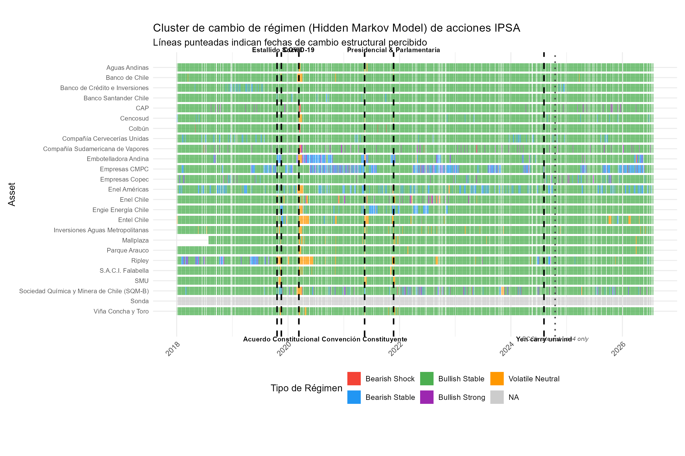

# Market Regime Detection in Chilean Equities

**Hidden Markov Models on the IPSA, mapped to structural-break events**

`R (tidyverse / depmixS4)` · `HMM + k-means` · `IPSA · Chile` · `Quant / Regime Detection`

Do Chile's political and economic shocks leave a common fingerprint across its
stock market? This project infers hidden return regimes for each stock in the
IPSA (the Santiago Exchange's main index), harmonizes them into a handful of
interpretable market-wide regime types, and flags the days when the whole
market switches at once. The detected switch dates are then annotated with the
real events they coincide with — the 2019 *estallido social*, the constitutional
process, national elections, and global market shocks.

## Result



Each row is a stock, each column a trading day, and the color is the inferred
cross-asset regime type. Black dashed lines mark days on which an unusually large
number of assets change regime simultaneously (≥ 8) — the candidate structural
breaks. The dotted grey line is a specification-dependent finding discussed below.

The market sits in a single calm regime (*Bullish Stable*) the large majority of
the time; the bearish and volatile regimes appear as bands that **concentrate
around the break dates** — most visibly the 2019 *estallido* and the March 2020
COVID crash.

## Method

1. **Data** — daily adjusted prices for the IPSA constituents from Yahoo Finance
   (2018–present), converted to log returns. (This run: 25 of 28 tickers loaded;
   3 failed to download — see *Limitations*.)
2. **Per-asset regimes (HMM)** — a **5-state** Gaussian Hidden Markov Model fit to
   each stock's return series (`depmixS4`), Viterbi-decoded into a latent state
   path.
3. **Harmonize regimes (clustering)** — raw HMM states aren't comparable across
   stocks, so each (asset, state) is summarized by its mean return and volatility
   and **k-means**-clustered into five cross-asset regime types. Each cluster is
   then labeled **by its actual return/volatility profile** (most-negative mean →
   *Bearish Shock*, highest mean → *Bullish Strong*, choppiest of the rest →
   *Volatile Neutral*, the remaining two by mean → *Bearish/Bullish Stable*), so
   the colors are meaningful regardless of k-means' arbitrary cluster numbering.
4. **Market-wide switch detection** — count how many assets change regime each
   day and flag local peaks (11-day window) where **≥ 8 assets** switch at once.
5. **Event overlay** — render the regime heatmap (asset × time) and annotate the
   detected break dates with the events they align with.

## Identified dates

At the ≥ 8 threshold the detector surfaces six market-wide breaks. They split
cleanly into **local Chilean political ruptures** and **global risk-off
episodes** — the point of the exercise. Because regimes are inferred purely from
returns, the method picks up both without being told about either.

| Date | Assets switching | Type | Event |
|------|:---:|---|------|
| **2019-10-21** | 14 | local | **Estallido Social** — the social uprising that erupted 18 Oct 2019; the sharpest domestic break in the sample. |
| **2019-11-18** | 16 | local | **Acuerdo Constitucional** — the 15 Nov 2019 agreement channeling the unrest into a plebiscite on a new constitution. |
| **2020-03-12** | 10 | global | **COVID-19 crash** — the global pandemic selloff; a worldwide risk-off break. |
| **2021-05-17** | 15 | local | **Convención Constituyente** — the 15–16 May 2021 election of Constitutional Convention delegates surprised markets. |
| **2021-11-23** | 9 | local | **Presidencial & Parlamentaria** — the first-round election setting up the polarized Kast–Boric runoff. |
| **2024-08-05** | 9 | global | **Yen carry unwind** — the August 2024 global equity selloff / VIX spike / Nikkei plunge. |

## Findings

**1. Shock detectability is regime-resolution-dependent (the 2024-10-17 case).**
A market-wide shift on **17 Oct 2024** is detected *only* under a **4-state** HMM
— it does not clear the co-movement threshold at 3 or 5 states (robust to
detection window ∈ {5,7,11} and threshold ∈ {3..6}). The date coincides with a
**domestic monetary-policy shock** — Banco Central de Chile's 25 bp cut to 5.25%
that day — a *local* rather than global signal. Mechanically, a 5-state model
splits the surrounding return distribution finely enough that the event registers
as different transitions across assets rather than one synchronized switch, while
the coarser 4-state model groups it into a single regime so the simultaneous
crossing becomes visible. **The implication: regime granularity is not a neutral
tuning knob — mid-sized local shocks can be masked or revealed purely by the
choice of state count.** The date is drawn on the figure as a dotted grey line.

**2. Not every real shock leaves an equity fingerprint (the Escondida null
result).** The August 2024 strike at BHP's Escondida — the world's largest copper
mine, and the longest private-sector mining strike in Chile's history (13–17 Aug
2024) — produces **no** detectable market-wide regime switch under *any*
specification tested (`nstates` ∈ {4,5,6}, window ∈ {5,7,11}, threshold ∈ {3..6}).
This is expected: Escondida (BHP) is not an IPSA constituent, so its footprint on
the equity index is indirect (via the copper price and the peso) and diffuse
rather than a synchronized equity move. The nearest August signal the detector
finds is the early-August global yen-carry unwind, not the mid-August strike.

**3. Both local and global breaks show up in one picture.** Four of the six
detected dates are Chilean political events; two (COVID, yen-carry) are global
risk-off episodes. The method separates neither by construction — both fall out
of returns alone.

## Limitations

- **Panel completeness varies by run.** Yahoo Finance occasionally fails to serve
  some `.SN` tickers; this run dropped CENCOSHOPP, ITAUCORP and SECURITY (25 of 28
  loaded). A smaller panel lowers the raw switch counts and can move borderline
  dates across the threshold.
- **One dominant regime.** The 5-state HMM assigns the large majority of
  asset-days to a single calm regime, so the heatmap is visually dominated by one
  color; regime *dispersion*, concentrated at the break dates, carries the signal.
- **History is not frozen.** Yahoo revises adjusted prices, so the exact regime
  coloring and the set of detected dates can shift between runs.

## Repository

```
├── trading_regimes_chile.Rmd   pipeline: data → HMM → clustering → plots
├── figures/
│   └── regime_heatmap.png       exported annotated regime heatmap
└── README.md
```

## Reproduce

Open `trading_regimes_chile.Rmd` in RStudio and knit it (or run the chunks in
order). The final chunk writes `figures/regime_heatmap.png`. Requires R with:
`tidyverse`, `tidyquant`, `depmixS4`, `lubridate`, `scales`, `zoo`, `slider`.

## Data & tools

- **Data** — Yahoo Finance daily adjusted close for IPSA (`.SN`) constituents,
  2018–present.
- **Tools** — R: `tidyverse` (wrangling), `tidyquant` (Yahoo Finance),
  `depmixS4` (Hidden Markov Models), `kmeans` (regime clustering), `zoo` /
  `slider` (rolling spike detection), `ggplot2` (heatmap).
